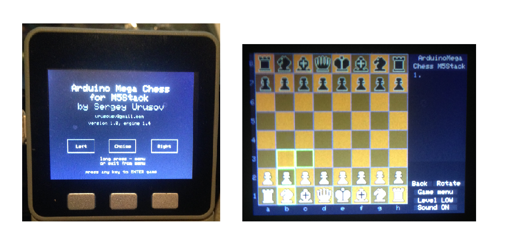

# M5Stack-MegaChess
## M5Core2ライブラリプロジェクト
M5Core2のSD-Updaterを用いたライブラリ集を構築するプロジェクトの一環として実装されています。

## どんなゲーム

いわずと知れたチェスゲームです。

 

以下は、Sergey UrusovさんによるArduinoからM5Stackへの移植における説明です。

- Arduino MegaChessをM5Stack ESP32開発システムで使用できるように変換。
- Sergey Urusovによるプロジェクト - 詳細はこちら[こちら](https://create.arduino.cc/projecthub/Sergey_Urusov/arduino-mega-chess-for-m5stack-7feafb)
- M5Stackプラットフォームの利点は、ESP32の再現性と処理能力であり、オリジナルプロジェクトのパフォーマンスレベルと比較すると、約15倍に向上し、毎秒2000～5000ノードとなり、困難な状況下ではツリーの解決深度が10倍に達し、容易な状況下ではさらに向上する。

こちらのプログラムをM5Core2に移植しました。

## コントロール
- インターフェースには左、選択、右の3つのボタンがあります。
- 左と右のボタンで着手を選択し（緑色の枠でハイライト表示されます）、選択ボタンで着手します。
- 選択ボタンを長押し（2回目の押下と離しの半分以上の時間）すると、メニューが開きます。または、メニューを閉じてゲームモードに戻ります。

## M5Stack-SD-Updater対応です

https://github.com/tobozo/M5Stack-SD-Updater 
https://github.com/lovyan03/M5Stack_LovyanLauncher 

# プログラマ

尾和 東/ぽこちゃ技術枠
